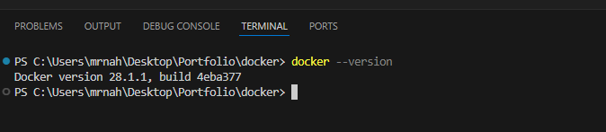

# Day 1: What is Docker? Install Docker on Linux

## 📌 What is Docker?
Docker হলো একটি ওপেন-সোর্স প্ল্যাটফর্ম যা দিয়ে lightweight, portable, self-sufficient containers তৈরি করা যায়।  
Container মানে হলো একটি ছোট প্যাকেজ যেখানে application এবং তার dependencies একসাথে থাকে, ফলে যেকোনো সিস্টেমে একইভাবে রান করা যায়।  

### 🔑 Why Docker?
- Consistent environment everywhere (local → staging → production)
- Lightweight (uses host kernel)
- Faster deployments
- Easy scaling

---

## ⚙️ Installation Steps (Linux)
1. Update package index:
   ```bash
   sudo apt-get update
2. Install prerequisites:
    ```bash
    sudo apt-get install ca-certificates curl gnupg lsb-release
3. Add Docker’s official GPG key:
    ```bash
    curl -fsSL https://download.docker.com/linux/ubuntu/gpg | sudo gpg --dearmor -o /usr/share/keyrings/docker-archive-keyring.gpg
4. Set up repository:
    ```bash
    echo "deb [arch=$(dpkg --print-architecture) signed-by=/usr/share/keyrings/docker-archive-keyring.gpg] https://download.docker.com/linux/ubuntu $(lsb_release -cs) stable" | sudo tee /etc/apt/sources.list.d/docker.list > /dev/null
5. Install Docker Engine:
    ```bash
    sudo apt-get update
    sudo apt-get install docker-ce docker-ce-cli containerd.io -y
6. Verify installation:
    ```bash
    docker --version

