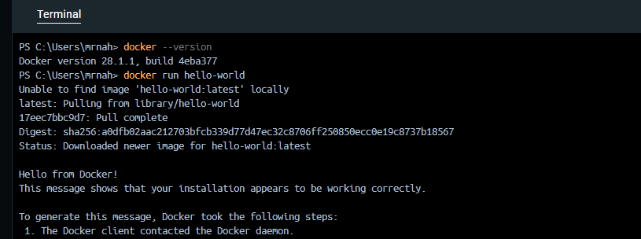

# Day 2 – Hello World Container 🚀

This is Day 2 of my Docker learning journey.  
Today, I ran the **official hello-world container** to verify Docker is installed and working correctly.  

---

## 🔹 Step 1: Verify Docker Installation
**Check Docker version:**   

`docker --version`

**Example output:**

`Docker version 27.0.3, build abc123`

## 🔹 Step 2: Run the Hello World Container

**Execute the following command:**  

`docker run hello-world` 
## 🔹 Step 3: What Happens?
* Docker looks for the hello-world image locally.

* If not found, it pulls it from Docker Hub.

* The container runs and prints a "Hello from Docker!" message.   
## 🔹 Example Output   
```bash
    Hello from Docker!   
    This message shows that your installation appears to be working correctly.

```
## 🔹 Verify Image & Container
**Check if the image was downloaded:**   

`docker images`    

**Check containers (even stopped ones):**       

`docker ps -a`
    
## ✅ Learning Outcome

* Successfully ran the first Docker container.

* Understood how Docker pulls images and runs containers.

* Verified Docker installation is working.
      
