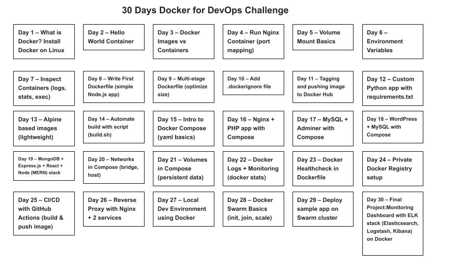

# 📅 30 Days Docker for DevOps Challenge (GitHub Friendly Plan)

## Phase 1: Basics (Day 1–7)

### 👉 Fundamentals + Simple Hands-on

### Day 1: – What is Docker? Install Docker on Linux

* Repo: day01-installation

* Files: README.md (notes), screenshot of version check

### Day 2: – Hello World Container

* Run docker run hello-world

* Repo: day02-hello-world

### Day 3: – Docker Images vs Containers

* Commands: docker ps, docker images

* Repo: day03-images-containers

### Day 4: – Run Nginx Container (port mapping)

* docker run -d -p 8080:80 nginx

* Repo: day04-nginx-container

### Day 5: – Volume Mount Basics

* Mount local HTML into nginx

* Repo: day05-volumes

### Day 6: – Environment Variables

* Run MySQL with env vars

* Repo: day06-env-vars

### Day 7: – Inspect Containers (logs, stats, exec)

* Repo: day07-container-inspect

## Phase 2: Dockerfiles (Day 8–14)

### 👉 Building your own images

### Day 8: – Write First Dockerfile (simple Node.js app)

* Repo: day08-dockerfile-node

### Day 9: – Multi-stage Dockerfile (optimize size)

* Repo: day09-multi-stage

### Day 10: – Add .dockerignore file

* Repo: day10-dockerignore

### Day 11: – Tagging and pushing image to Docker Hub

* Repo: day11-dockerhub-push

### Day 12: – Custom Python app with requirements.txt

* Repo: day12-python-app

### Day 13: – Alpine based images (lightweight)

* Repo: day13-alpine-image

### Day 14: – Automate build with script (build.sh)

* Repo: day14-build-script

## Phase 3: Docker Compose (Day 15–21)

### 👉 Multi-container setup

### Day 15: – Intro to Docker Compose (yaml basics)

* Repo: day15-compose-basic

### Day 16: – Nginx + PHP app with Compose

* Repo: day16-php-nginx

### Day 17: – MySQL + Adminer with Compose

* Repo: day17-mysql-adminer

### Day 18: – WordPress + MySQL with Compose

* Repo: day18-wordpress

### Day 19: – MongoDB + Express.js + React + Node (MERN) stack

* Repo: day19-mern-compose

### Day 20: – Networks in Compose (bridge, host)

* Repo: day20-compose-networks

### Day 21: – Volumes in Compose (persistent data)

* Repo: day21-compose-volumes

## Phase 4: DevOps Integration (Day 22–30)

### 👉 Real DevOps-focused projects

### Day 22: – Docker Logs + Monitoring (docker stats)

* Repo: day22-monitoring

### Day 23: – Docker Healthcheck in Dockerfile

* Repo: day23-healthcheck

### Day 24: – Private Docker Registry setup

* Repo: day24-private-registry

### Day 25: – CI/CD with GitHub Actions (build & push image)

* Repo: day25-github-actions

### Day 26: – Reverse Proxy with Nginx + 2 services

* Repo: day26-reverse-proxy

### Day 27: – Local Dev Environment using Docker

* Repo: day27-local-dev

### Day 28: – Docker Swarm Basics (init, join, scale)

* Repo: day28-swarm-basics

### Day 29: – Deploy sample app on Swarm cluster

* Repo: day29-swarm-deploy

### Day 30: – Final Project:

* Monitoring Dashboard with ELK stack (Elasticsearch, Logstash, Kibana) on Docker

* Repo: day30-elk-stack